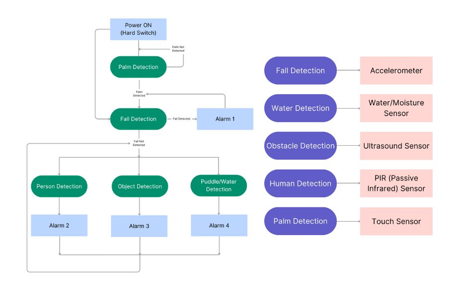

# SStick-SmartBlindStick
An Arduino-based smart blind stick using sensors for person, obstacle, fall, and water detection.

A fully functional **Arduino-based blind stick** that enhances mobility and safety with real-time detection of **people, obstacles, water**, and **falls**, using a combination of sensors and modular feedback systems (buzzer, LED, vibration motor).
Activated with a touch, this stick senses danger—buzzes, vibrates, and lights up. Whether it's a puddle, a wall, or a fall, it's got your back.

---

## 🎯 Key Features

- 📏 **Ultrasonic Sensor** — Measures distance to obstacles (<1 meter)
- 🧍‍♂️ **PIR Sensor** — Detects human motion nearby
- 🫧 **Water Sensor** — Detects puddles and wet surfaces
- 🌀 **Accelerometer** — Detects sudden falls or shocks
- 🤚 **Touch Activation** — Touch to boot/reset system
- 🔔 **Adaptive Buzzer Alerts** — Custom sound patterns for different threats
- 💡 **Visual LED Feedback**
- 🧠 **Perception-Based System** — Combines multiple sensor inputs for intelligent environmental feedback

---

## 🧠 Block Diagram



---

## 🔌 Wiring Diagram


---

## 🗂️ Folder Structure

```plaintext
SStick-SmartBlindStick/
├── src/                    # Source code
│   ├── Sstick.ino          # Main Arduino sketch
│   ├── BuzzerControl.cpp
│   ├── BuzzerControl.h
│   ├── VibrationControl.cpp
│   ├── VibrationControl.h
│   ├── LEDControl.cpp       # LED control logic
│   ├── LEDControl.h
├── images/                 # Diagrams and model photos
│   ├── wiring_diagram.png
│   ├── block_diagram.png
├── README.md               # You're reading it!

💡 All sensor logic is modularized into .cpp/.h control classes under src/ for clarity and scalability.
```
---

## How to Use

### 🛠️ Hardware Required
- Arduino Uno/Nano  
- Ultrasonic Sensor (HC-SR04)  
- PIR Motion Sensor (HC-SR501) / Mini Infrared PIR Motion Sensor (HC-SR505)  
- Capacitive Touch Sensor (TTP223 x2)  
- Soil Moisture Sensor Module (or any water sensor)  
  → *Remove the probes and attach any conducting material suitable for your model (e.g., screws)*  
- Passive Buzzer Module (Active-LOW)  
- LED, 220Ω Resistor  
- Accelerometer (ADXL345)  
- Coin-Type Vibration Motor  
- Round Toggle Switch  
- Battery Pack

### ✏️ Sketch


--- 

### ⚙️ Setup Instructions
1. Connect components as per the wiring diagram  
2. Clone this repository and open it in Arduino IDE  
3. Install the `Adafruit_ADXL345` library via Arduino Library Manager  
4. Touch to activate — let perception take over!


---

## Contribution
Feel free to fork this repository and contribute. For major changes, please open an issue first to discuss what you'd like to change.

Made with purpose ❤️
